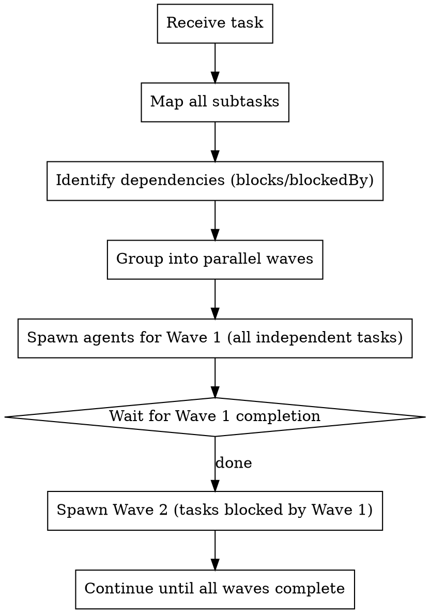

# Maximum Parallelism Mode

## Overview

**Default to parallel, not sequential.** Before executing ANY multi-step task, first map dependencies then spawn maximum concurrent agents.

## The Pattern



## Execution Rules

### 1. ALWAYS Map Before Acting

Before ANY implementation:
```
1. List ALL subtasks (don't start with just one)
2. For each pair: "Does A need B's output?" → B blocks A
3. Tasks with no blockers = Wave 1 (parallel)
4. Tasks blocked only by Wave 1 = Wave 2 (parallel after Wave 1)
```

### 2. ALWAYS Use Parallel Tool Calls

**WRONG - Sequential:**
```
Task("Explore auth module")
[wait for result]
Task("Explore database module")
[wait for result]
Task("Explore API module")
```

**RIGHT - Parallel (single message, multiple tool calls):**
```
Task("Explore auth module")     // These all spawn
Task("Explore database module") // in a single message
Task("Explore API module")      // executing concurrently
```

### 3. Match Model to Task Complexity

| Task Type | Model | Why |
|-----------|-------|-----|
| File exploration, glob, grep | `haiku` | Fast, cheap, sufficient |
| Code reading, understanding | `sonnet` | Balance of speed/capability |
| Architecture, complex logic | `opus` | Deep reasoning needed |
| Simple file operations | `haiku` | Don't waste tokens |

### 4. Use TaskCreate with Dependencies

```
TaskCreate("Implement auth service")     // id: 1
TaskCreate("Implement user model")       // id: 2
TaskCreate("Implement API routes")       // id: 3, blocks: [1, 2]
TaskCreate("Write integration tests")    // id: 4, blockedBy: [3]
```

Tasks 1 and 2 run parallel. Task 3 waits for both. Task 4 waits for 3.

## Quick Reference

| Scenario | Action |
|----------|--------|
| Exploring codebase | Spawn 3-5 Explore agents with different focuses simultaneously |
| Multiple test failures | One agent per test file in parallel |
| Feature implementation | Map all components, spawn parallel for independent ones |
| Research questions | Spawn multiple search agents with different queries |
| Code review | Parallel agents for different aspects (security, performance, style) |

## Example: Feature Implementation

**Task:** "Add user authentication"

**WRONG (sequential):**
```
1. Research auth patterns [wait]
2. Implement user model [wait]
3. Implement auth service [wait]
4. Add API routes [wait]
5. Write tests [wait]
```

**RIGHT (parallel waves):**
```
Wave 1 (parallel - no dependencies):
  - Task("Research auth patterns", model="haiku")
  - Task("Research existing user code", model="haiku")
  - Task("Research API patterns in codebase", model="haiku")

Wave 2 (parallel - after Wave 1):
  - Task("Implement user model")
  - Task("Implement auth service")

Wave 3 (after Wave 2):
  - Task("Add API routes", blockedBy=[user_model, auth_service])

Wave 4 (after Wave 3):
  - Task("Write tests", blockedBy=[api_routes])
```

**Result:** 4 waves instead of 5 sequential steps. Wave 1 runs 3x faster than sequential.

## Trigger Phrases

When user says any of these, invoke /max-parallel:
- "do this in parallel"
- "spawn multiple agents"
- "maximize parallelism"
- "work faster"
- "parallelize this"

## Anti-Patterns (NEVER DO)

- Starting with step 1 before mapping all steps
- Sequential tool calls when parallel is possible
- Using Opus for file exploration
- Single-threaded investigation of independent failures
- Waiting for one search before starting another unrelated search

## The Iron Law

```
If tasks are independent, they MUST run in parallel.
Sequential execution of independent tasks is a bug.
```
