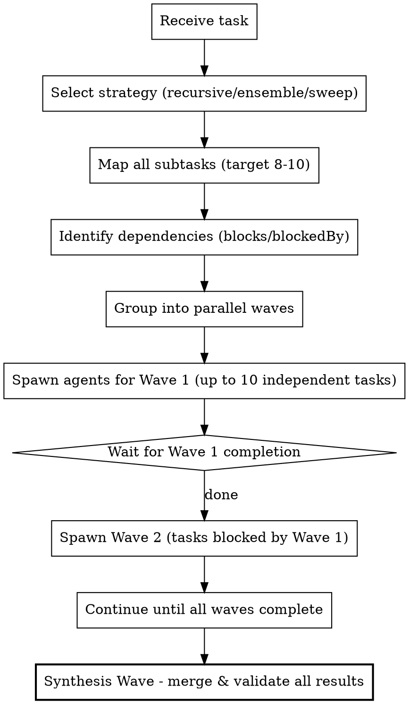

# Maximum Parallelism Mode

## Overview

**Default to parallel, not sequential.** Before executing ANY multi-step task, first map dependencies then spawn maximum concurrent agents (target: **8-10 per wave**).

## Strategies

Three execution strategies available (default: `recursive`):

| Strategy | Best For | Description |
|----------|----------|-------------|
| **recursive** | General tasks | Decompose → Execute in waves → Synthesize |
| **ensemble** | High-stakes decisions | Same subtask → 2-3 models independently → merge/compare |
| **sweep** | Codebase understanding | Max breadth Wave 1 (up to 10 agents), each a different angle |

## The Pattern



## Execution Rules

### 1. ALWAYS Map Before Acting

Before ANY implementation:
```
1. List ALL subtasks — target 8-10 per wave (don't stop at 2-3)
2. For each pair: "Does A need B's output?" → B blocks A
3. Tasks with no blockers = Wave 1 (parallel)
4. Tasks blocked only by Wave 1 = Wave 2 (parallel after Wave 1)
5. After all waves: Synthesis wave (MANDATORY)
```

### 2. ALWAYS Use Parallel Tool Calls

**WRONG - Sequential:**
```
Task("Explore auth module")
[wait for result]
Task("Explore database module")
[wait for result]
Task("Explore API module")
```

**RIGHT - Parallel (single message, multiple tool calls):**
```
Task("Explore auth module")     // These all spawn
Task("Explore database module") // in a single message
Task("Explore API module")      // executing concurrently
Task("Explore state mgmt")     // Keep going —
Task("Explore config layer")   // target 8-10 agents
Task("Explore error handling") // per wave
```

### 3. Match Model to Task Complexity

| Task Type | Model | Why |
|-----------|-------|-----|
| File exploration, glob, grep | `haiku` | Fast, cheap, sufficient |
| Code reading, understanding | `sonnet` | Balance of speed/capability |
| Architecture, complex logic | `opus` | Deep reasoning needed |
| Ensemble verification | mix all 3 | Different perspectives |
| Synthesis / final merge | `opus` | Needs to reconcile all findings |

### 4. Use TaskCreate with Dependencies

```
TaskCreate("Implement auth service")     // id: 1
TaskCreate("Implement user model")       // id: 2
TaskCreate("Implement API routes")       // id: 3, blocks: [1, 2]
TaskCreate("Write integration tests")    // id: 4, blockedBy: [3]
```

Tasks 1 and 2 run parallel. Task 3 waits for both. Task 4 waits for 3.

### 5. Mandatory Synthesis Wave

After all execution waves complete, ALWAYS spawn a synthesis agent:

```
Task("Synthesize and validate all results from Waves 1-N", subagent_type="general-purpose", model="opus")
```

The synthesis agent must:
- Merge findings from all agents into a coherent summary
- Flag contradictions or conflicts between agent results
- Validate completeness — did we miss anything?
- Produce the final deliverable

## Quick Reference

| Scenario | Action |
|----------|--------|
| Exploring codebase | Spawn 8-10 Explore agents with different focuses simultaneously |
| Multiple test failures | One agent per test file in parallel (up to 10) |
| Feature implementation | Map all components, spawn parallel for independent ones |
| Research questions | Spawn multiple search agents with different queries |
| Code review | Parallel agents for different aspects (security, performance, style, correctness) |
| High-stakes decision | Use **ensemble** strategy: same question → 3 models → merge |
| Open-ended exploration | Use **sweep** strategy: 10 agents, each a different angle |

## Example: Feature Implementation (Recursive Strategy)

**Task:** "Add user authentication"

**WRONG (sequential):**
```
1. Research auth patterns [wait]
2. Implement user model [wait]
3. Implement auth service [wait]
4. Add API routes [wait]
5. Write tests [wait]
```

**RIGHT (parallel waves, 10 agents):**
```
Wave 1 (parallel - no dependencies, 6 agents):
  - Task("Research auth patterns in codebase", model="haiku")
  - Task("Research existing user model code", model="haiku")
  - Task("Research API route patterns", model="haiku")
  - Task("Research middleware patterns", model="haiku")
  - Task("Research test patterns", model="haiku")
  - Task("Research config/env for auth secrets", model="haiku")

Wave 2 (parallel - after Wave 1, 3 agents):
  - Task("Implement user model", model="sonnet")
  - Task("Implement auth service", model="sonnet")
  - Task("Implement auth middleware", model="sonnet")

Wave 3 (after Wave 2):
  - Task("Add API routes", blockedBy=[user_model, auth_service, middleware])

Wave 4 (after Wave 3):
  - Task("Write tests", blockedBy=[api_routes])

Wave 5 (Synthesis - MANDATORY):
  - Task("Validate auth implementation: review all changes, run tests, check security", model="opus")
```

**Result:** 5 waves with up to 6 agents in Wave 1. Massively faster than sequential.

## Example: Ensemble Strategy

**Task:** "Should we use Redis or PostgreSQL for session storage?"

```
Wave 1 (ensemble - same question, 3 models):
  - Task("Analyze: Redis vs PostgreSQL for session storage given our codebase", model="haiku")
  - Task("Analyze: Redis vs PostgreSQL for session storage given our codebase", model="sonnet")
  - Task("Analyze: Redis vs PostgreSQL for session storage given our codebase", model="opus")

Wave 2 (synthesis):
  - Task("Compare 3 independent analyses, flag agreements/disagreements, produce recommendation", model="opus")
```

## Example: Sweep Strategy

**Task:** "Understand this new codebase"

```
Wave 1 (sweep - 10 agents, maximum breadth):
  - Task("Explore: project structure and entry points", model="haiku")
  - Task("Explore: database models and schema", model="haiku")
  - Task("Explore: API routes and controllers", model="haiku")
  - Task("Explore: authentication and authorization", model="haiku")
  - Task("Explore: frontend components and state", model="haiku")
  - Task("Explore: test infrastructure and coverage", model="haiku")
  - Task("Explore: build system and CI/CD", model="haiku")
  - Task("Explore: configuration and environment", model="haiku")
  - Task("Explore: error handling and logging", model="haiku")
  - Task("Explore: third-party integrations", model="haiku")

Wave 2 (synthesis):
  - Task("Synthesize all 10 explorations into architecture overview", model="opus")
```

## Trigger Phrases

When user says any of these, invoke /max-subagents-parallel:
- "do this in parallel"
- "spawn multiple agents"
- "maximize parallelism"
- "work faster"
- "parallelize this"

## Anti-Patterns (NEVER DO)

- Starting with step 1 before mapping all steps
- Sequential tool calls when parallel is possible
- Using Opus for file exploration
- Single-threaded investigation of independent failures
- Waiting for one search before starting another unrelated search
- Stopping at 3-5 agents when 8-10 would be more effective
- Skipping the synthesis wave

## The Iron Law

```
If tasks are independent, they MUST run in parallel.
Sequential execution of independent tasks is a bug.
```
